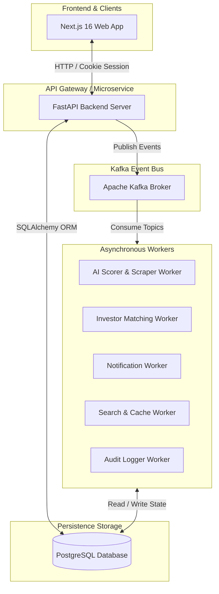
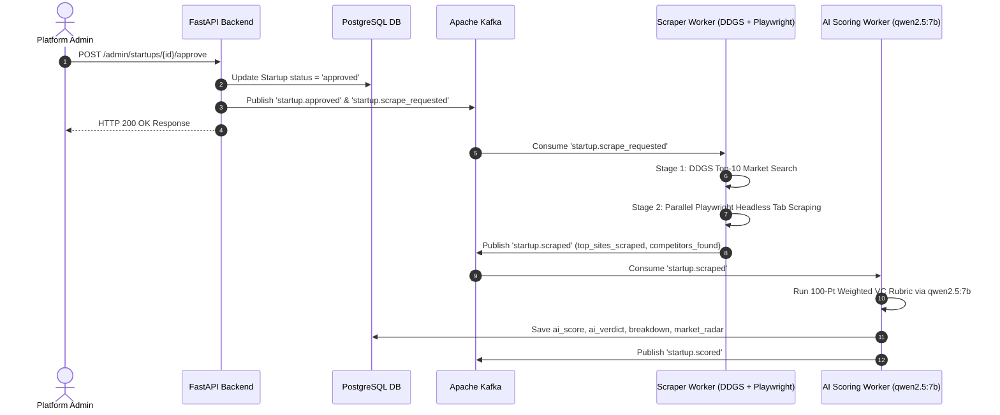
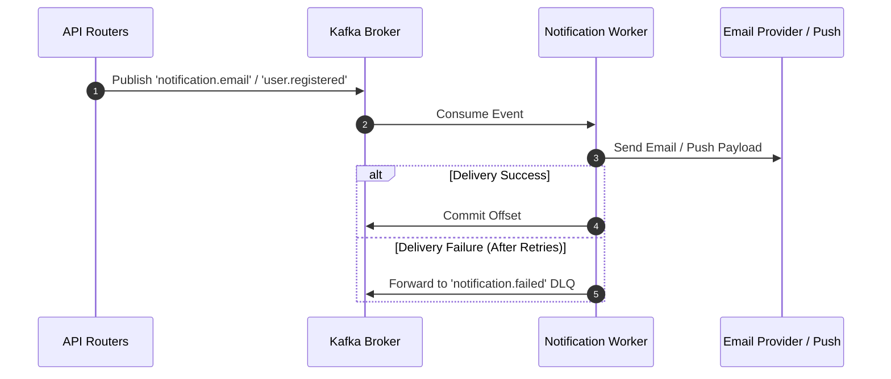
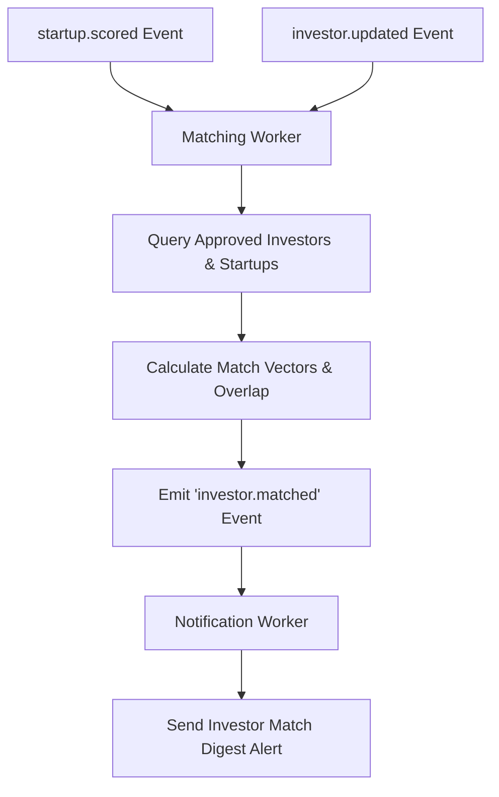

# System Architecture & Event-Driven Design

## Overview
The Foundry Platform is designed as an asynchronous, event-driven microservice architecture with FastAPI handling HTTP REST requests, PostgreSQL managing system state, and Apache Kafka handling distributed message streaming and background task coordination.

---

## System Architecture Diagram

---

## Detailed Sequence & Flow Diagrams

### 1. Startup Approval, Dual-Stage Scraping & AI Scoring Sequence

### 2. Notification Pipeline Flow

### 3. Startup-Investor Matching Pipeline

---

## Domain Boundaries & Microservices

1. **Authentication & Identity**: Firebase ID token validation, HTTP-Only session creation, system admin authentication.
2. **Startup Management**: Company profile submission, pitch deck storage, review revision pipelines.
3. **AI Deal Evaluation**: Web metadata extraction, financial unit economics scoring, valuation multiple assessment.
4. **Investor Match Engine**: Investment domain preference filtering, match scoring vector generation.
5. **Feed & Discussion**: Community forum posts, threaded discussions, real-time unread state tracking.
6. **Messaging System**: Direct 1-on-1 investor-founder inquiry channels.
7. **Audit & Compliance**: System change audit logging for admin decision transparency.
