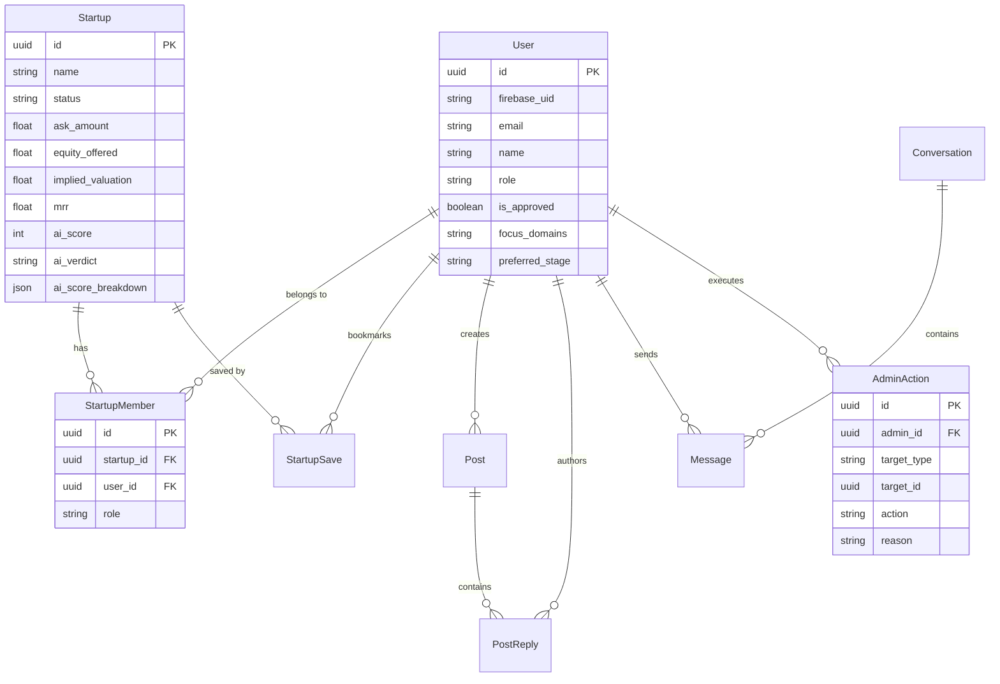

# Backend Architecture & Technical Reference

## Tech Stack & Core Libraries

- **Framework**: FastAPI (`fastapi==0.135.3`) with Uvicorn ASGI server (`uvicorn==0.43.0`).
- **Database & ORM**: PostgreSQL with SQLAlchemy 2.0 (`SQLAlchemy==2.0.49`) and Alembic migrations.
- **Messaging**: Apache Kafka (`aiokafka==0.14.0`).
- **Validation**: Pydantic v2 (`pydantic==2.12.5`).
- **Authentication**: Firebase Admin SDK (`firebase_admin==7.3.0`) & PyJWT (`PyJWT==2.12.1`).

---

## Backend Directory Structure

```
backend/
├── core/
│   ├── config.py           # Application Settings (Pydantic BaseSettings)
│   └── security.py         # Session token generation & FastAPI auth dependencies
├── database.py             # SQLAlchemy Engine, SessionLocal, Base model
├── kafka/                  # Kafka messaging module
│   ├── config.py           # Kafka environment parameters
│   ├── consumer.py         # Async AIOKafkaConsumer wrapper & DLQ logic
│   ├── manager.py          # Centralized KafkaManager
│   ├── producer.py         # Async AIOKafkaProducer wrapper
│   ├── schemas.py          # EventEnvelope & topic payload definitions
│   └── topics.py           # Topic constants & DLQ mapping
├── main.py                 # FastAPI application setup & lifespan hooks
├── models.py               # ORM Database Table models
├── requirements.txt        # Python package dependencies
├── routers/                # API Routers
│   ├── admin.py            # System administration & approval queue
│   ├── auth.py             # Google OAuth & session authentication
│   ├── dataroom.py         # Financial data room & document access
│   ├── feed.py             # Community discussion feed
│   ├── messages.py         # Founder-investor messaging
│   ├── startup.py          # Startup lifecycle & profile management
│   └── users.py            # User profile management & investor catalog
├── schemas.py              # Request/Response Pydantic schemas
├── services/               # Core business services
│   ├── ai_scorer.py        # 100-Pt Weighted VC Rubric Evaluator (Ollama kimi-k3)
│   ├── market_radar.py     # Competitor analysis & market radar generator
│   └── scraper.py          # Dual-stage web scraping (DDGS + Playwright)
└── workers/                # Standalone Kafka background workers
    ├── scraper_worker.py        # Top-10 Dual-Stage Web Scraper (ddgs + Playwright)
    ├── ai_scoring_worker.py     # Multi-Parameter AI Scorer (kimi-k3)
    ├── audit_worker.py
    ├── matching_worker.py
    ├── notification_worker.py
    └── search_indexer_worker.py
```

---

## Database Models & Entity Relations



---

## Connection Pooling & Database Health

`backend/database.py` enforces production connection pooling parameters:
- `pool_pre_ping=True`: Detects dropped connections prior to transaction execution.
- `pool_recycle=3600`: Recycles database connections hourly to prevent stale sockets.
