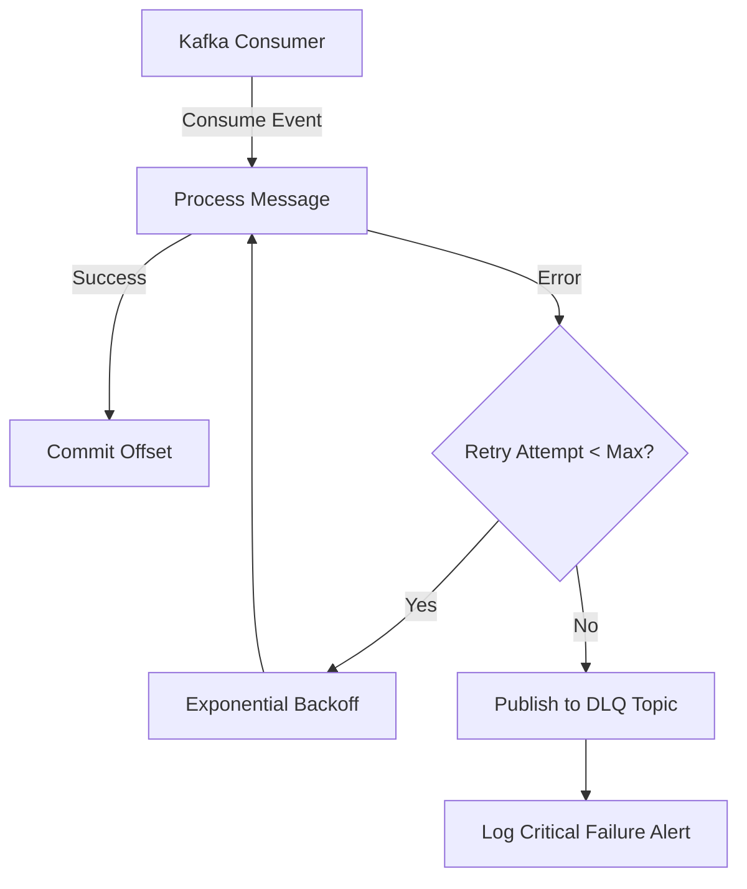
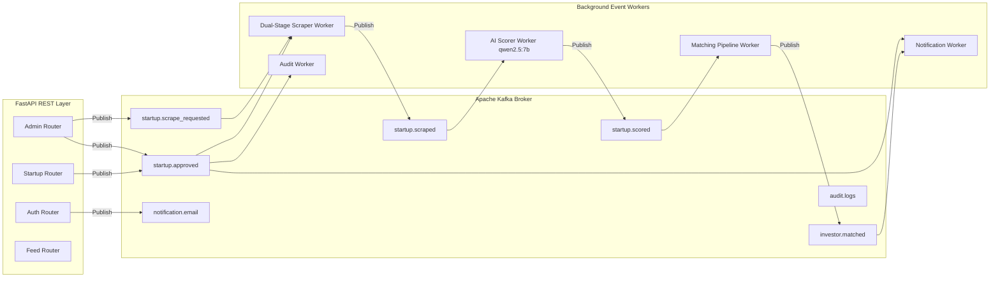
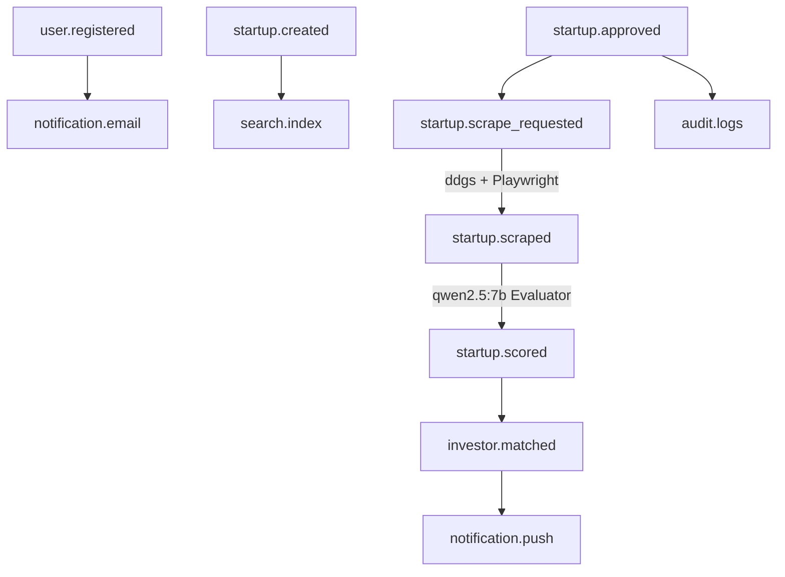

# Foundry Event-Driven Kafka Architecture Guide

## Overview

Apache Kafka serves as the central event streaming backbone for the **Foundry Platform**. Rather than using tightly coupled, synchronous REST calls for long-running workflows (web scraping, AI deal evaluation, match computations, search indexing, notifications), Foundry leverages an asynchronous, event-driven architecture.

---

## 1. Core Kafka Architectural Concepts

### Broker & Cluster
The Kafka Broker processes, stores, and serves event records across topics. In local development and Docker Compose setups, Kafka operates in Zookeeper-less **KRaft mode** (`bitnami/kafka:3.7`).

### Topic
A named stream of records. In Foundry, topics follow a domain-driven dot-separated naming convention (`<entity>.<action>` or `<domain>.<event>`):
- `startup.created`, `startup.updated`, `startup.approved`, `startup.rejected`, `startup.deleted`, `startup.saved`
- `startup.scrape_requested`, `startup.scraped`, `startup.score_requested`, `startup.scored`
- `user.registered`, `investor.registered`, `investor.updated`, `investor.matched`
- `notification.email`, `notification.push`
- `feed.post_created`, `feed.reply_created`, `message.sent`
- `audit.logs`, `cache.invalidate`, `search.index`

### Partition & Ordering Guarantees
Topics are divided into **Partitions** to enable parallel processing and horizontal scalability.
- **Ordering Guarantee**: Kafka guarantees strict message ordering **within a single partition**.
- **Partition Keying**: Foundry uses entity IDs (`startup_id`, `user_id`, or `conversation_id`) as the partition key when publishing events. All events pertaining to the same startup or user are guaranteed to arrive at the same partition in sequential order.

### Offset & Delivery Semantics
- **Offset**: An incremental integer ID assigned to each record within a partition.
- **Delivery Guarantee**: Foundry enforces **At-Least-Once Delivery** with idempotent consumers.
- **Auto-Commit / Explicit Commits**: Consumer groups commit offsets upon successful event processing.

### Consumer Group
Consumers reading from topics are grouped into **Consumer Groups**. Each partition in a topic is assigned to exactly one consumer instance within a group, enabling load balancing and scalable parallel consumption:
- `scraper-worker-group`: Dual-Stage Web Scraping Pipeline (DDGS + Parallel Playwright)
- `ai-scorer-worker-group`: 100-Point VC Deal Scoring Rubric (`qwen2.5:7b` model)
- `notification-worker-group`: Email and push notification dispatches
- `matching-worker-group`: Domain overlap and investor deal matching
- `search-indexer-worker-group`: Catalog indexation and cache invalidation
- `audit-worker-group`: System admin decision persistence

---

## 2. Standardized Event Payload Schema

All events published across Foundry use a standardized, versioned JSON envelope (`EventEnvelope`):

```json
{
  "event_id": "c7a2b918-4e12-4f9e-8c31-9b12d345e678",
  "event_type": "startup.approved",
  "timestamp": "2026-08-04T12:00:00Z",
  "version": "1.0",
  "source_service": "foundry-backend",
  "correlation_id": "a1b2c3d4-e5f6-7890-1234-56789abcdef0",
  "startup_id": "e9b8a7c6-d5e4-3f2a-1b0c-9d8e7f6a5b4c",
  "user_id": "f1e2d3c4-b5a6-7890-1234-56789abcdef0",
  "payload": {
    "startup_id": "e9b8a7c6-d5e4-3f2a-1b0c-9d8e7f6a5b4c",
    "approved_by": "f1e2d3c4-b5a6-7890-1234-56789abcdef0",
    "approval_notes": "Meets criteria",
    "approved_at": "2026-08-04T12:00:00Z"
  }
}
```

---

## 3. Failure Recovery, Retries & Dead Letter Queue (DLQ)

When a consumer encounters a processing failure (e.g. temporary network downtime, external API throttling):
1. **Retries**: The consumer wrapper executes up to `KAFKA_MAX_RETRY_ATTEMPTS` (default: 3) with exponential backoff (`KAFKA_RETRY_BACKOFF_MS`).
2. **Dead Letter Queue (DLQ)**: If all retries are exhausted, the event is wrapped with error metadata and forwarded to a dedicated DLQ topic:
   - `startup.approved` ➡️ `startup.failed`
   - `startup.scrape_requested` ➡️ `scraping.failed`
   - `notification.email` ➡️ `notification.failed`
   - `investor.matched` ➡️ `matching.failed`
   - `audit.logs` ➡️ `audit.failed`



---

## 4. System & Pipeline Diagrams

### Overall Event Architecture


### Topic Relationships & Topology


---

## 5. Environment Variables & Setup

| Variable Name | Default | Description |
|---|---|---|
| `KAFKA_BOOTSTRAP_SERVERS` | `localhost:9092` | Kafka broker host & port |
| `KAFKA_CLIENT_ID` | `foundry-backend` | Producer/Consumer client identifier |
| `KAFKA_CONSUMER_GROUP_PREFIX` | `foundry-group` | Consumer group prefix |
| `KAFKA_MAX_RETRY_ATTEMPTS` | `3` | Maximum processing retries before DLQ |
| `KAFKA_RETRY_BACKOFF_MS` | `1000` | Backoff milliseconds between retries |
