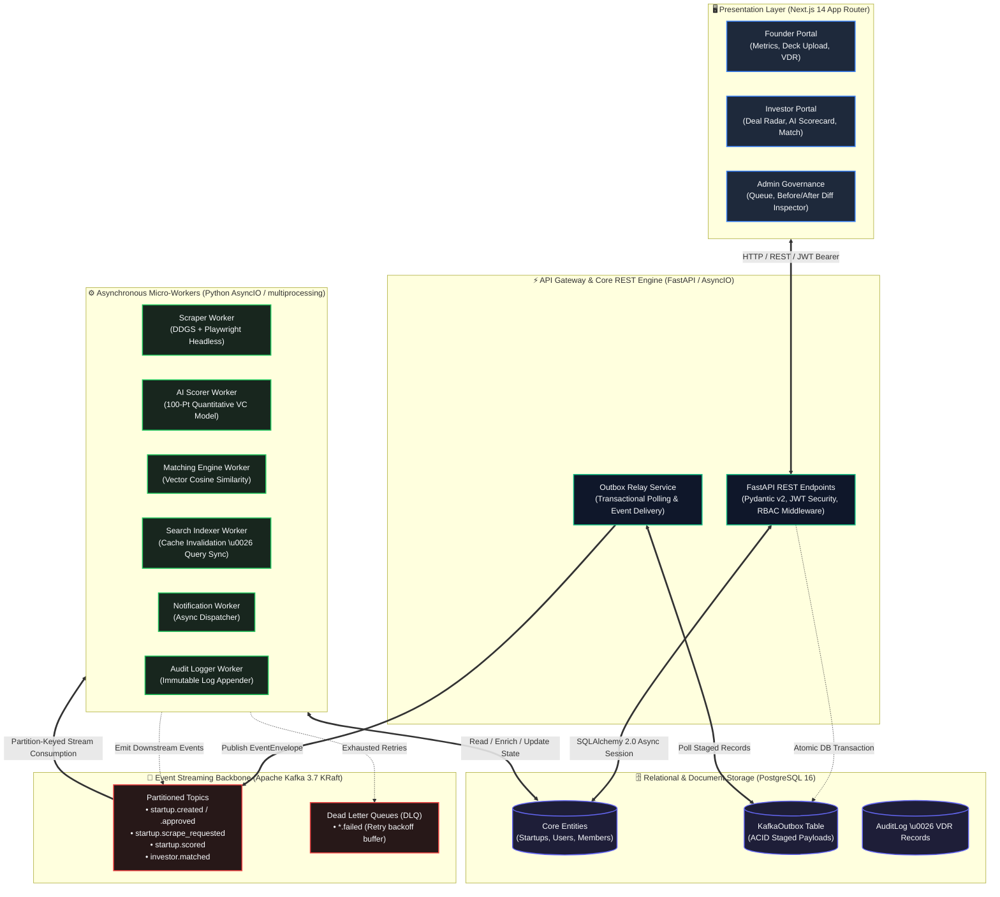
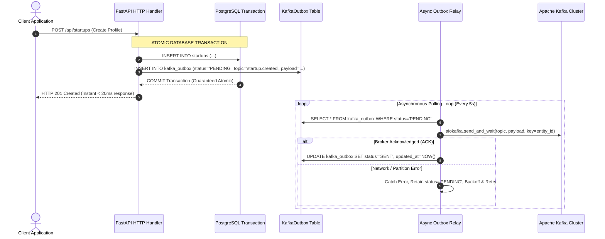
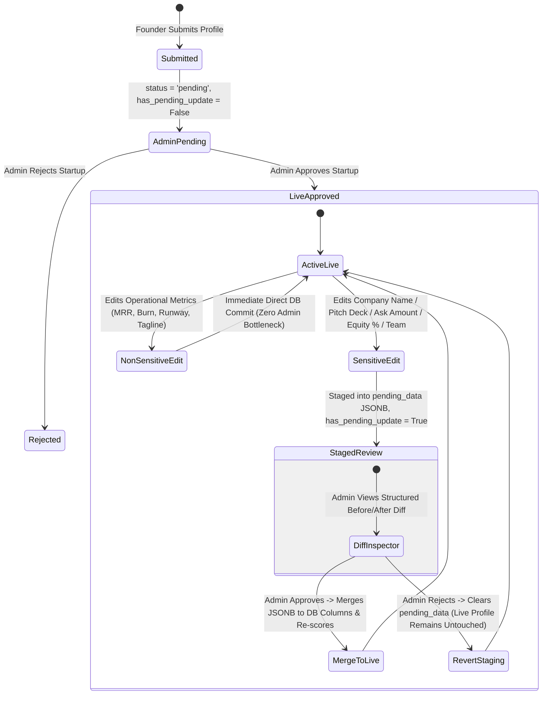

<div align="center">

# ⚡ Foundry Distributed Platform
### *High-Throughput Event-Driven Microservices Architecture & AI-Assisted Venture Intelligence Engine*

[](https://www.python.org/)
[](https://fastapi.tiangolo.com/)
[](https://kafka.apache.org/)
[](https://www.postgresql.org/)
[](https://nextjs.org/)
[](https://www.docker.com/)
[](https://playwright.dev/)
[](https://ollama.com/)

<p align="center">
  <b>A full-stack, distributed event-driven systems project showcasing advanced software engineering patterns: Transactional Outbox resilience, asynchronous Kafka micro-worker streaming, headless browser crawling, quantitative AI due diligence modeling, and zero-downtime tiered state machine governance.</b>
</p>

[Architecture & Design Patterns](#-system-architecture--design-patterns) • [Key Engineering Innovations](#-key-engineering-innovations) • [Distributed Pipeline Deep-Dive](#-distributed-pipeline-deep-dive) • [Data Modeling & ACID Guarantees](#-data-modeling--persistence-layer) • [Local Deployment](#-local-setup--deployment)

---

</div>

## 📐 System Architecture & Design Patterns

Foundry is designed from the ground up as a decoupled, horizontally scalable, event-driven system. Long-running analytical tasks (LLM valuation, deep DOM web crawling, vector similarity calculations, search indexing) are completely offloaded from the synchronous HTTP request-response cycle into dedicated asynchronous Kafka worker clusters.



---

## 🛠️ Key Engineering Innovations

### 1. 🛡️ Transactional Outbox Pattern (Eliminating Distributed Dual-Write Loss)
Directly writing to a relational database and publishing to a message broker in an HTTP handler leads to the **Dual-Write Problem**: if Kafka crashes during a network partition, the database commit succeeds while the message is permanently lost.

Foundry solves this by enforcing database-level atomicity:
* The REST endpoint writes business data and an event record into `KafkaOutbox(status='PENDING', topic, payload)` within the **exact same ACID database transaction**.
* An asynchronous **Outbox Relay Worker** polls pending records, streams them to Kafka using `aiokafka.send_and_wait()` with partition keying, and updates the outbox state to `SENT`.
* If Kafka is temporarily down, the database transaction remains 100% consistent, and the relay retries with exponential backoff.



---

### 2. 🧠 Multi-Pillar Quantitative AI Due Diligence Engine
Instead of relying on basic keyword filters or rigid if-else rules, Foundry implements a **100-Point Quantitative Venture Capital Due Diligence Rubric** executed via **Ollama (`qwen2.5:7b` / `llama3.1`)**:

$$\text{Total Valuation Score} = W_{\text{traction}} S_{\text{traction}} + W_{\text{team}} S_{\text{team}} + W_{\text{market}} S_{\text{market}} + W_{\text{valuation}} S_{\text{valuation}} + W_{\text{moat}} S_{\text{moat}}$$

```mermaid
flowchart LR
    subgraph DataInputs["1. Structured & Unstructured Inputs"]
        D1["Financial Metrics<br/>(MRR, ARR, MoM %, Burn, Runway)"]
        D2["Deal Terms<br/>(Ask Amount, Equity %, Implied Val)"]
        D3["PDF Pitch Deck Parser<br/>(pypdf Slide Extraction \u0026 OCR)"]
        D4["Web Scraper Data<br/>(Live Competitors \u0026 Tech Stack)"]
    end

    subgraph LLMContext["2. Context & Prompt Assembly"]
        P1["VC General Partner Prompt Envelope"]
        P2["Quantitative Calibration Matrices"]
    end

    subgraph ScoringEngine["3. 5-Pillar Evaluation Core"]
        E1["📈 Unit Economics (25 Pts)"]
        E2["👥 Team Execution DNA (20 Pts)"]
        E3["🎯 Market TAM & Defensibility (25 Pts)"]
        E4["💼 Valuation Realism & Terms (20 Pts)"]
        E5["✨ Pitch Clarity & Defensibility (10 Pts)"]
    end

    subgraph FinalOutput["4. Structured Deal Output"]
        O1["🏆 Score: 0 - 100"]
        O2["📋 Verdict: Strong Buy / Consider / Pass"]
        O3["💡 Strategic Strengths & Critical Red Flags"]
    end

    DataInputs --> LLMContext --> ScoringEngine --> FinalOutput
```



* **Deterministic Fallback Engine**: If the inference server experiences latency or network disconnects, the system automatically falls back to mathematical heuristic calculations (analyzing ARR multiples, capital efficiency ratios, and runway safety margins), ensuring **zero endpoint downtime**.

---

### 3. 🌐 Dual-Stage Autonomous Market Reconnaissance Crawler
When a startup is approved, the **Scraper Worker** initiates a two-stage automated reconnaissance pipeline:
1. **Stage 1 (Search Discovery)**: Queries the DuckDuckGo Search API (`ddgs`) to discover top industry search results and identify direct competitors.
2. **Stage 2 (Deep Browser DOM Extraction)**: Launches headless **Chromium instances via Playwright**, extracts title tags, meta descriptions, and structural keywords, and constructs a structured competitor profile for the AI Scoring Engine.

---

### 4. 🛡️ Zero-Downtime Tiered Verification State Machine
To maintain data integrity while ensuring a smooth founder experience, the platform enforces a **Dual-Lane Field Governance Architecture**:



* **Live vs Staged Fields**:
  - **Instant Live Updates**: `tagline`, `description`, `stage`, `domains`, `website_url`, `logo_url`, `use_of_funds`, `mrr`, `growth_rate_pct`, `burn_rate`, `runway_months`, `gross_margin_pct`, `main_competitors`, `moat_description`.
  - **Admin Re-Verification Required**: `name`, `pitch_deck_url`, `ask_amount`, `equity_offered`, `implied_valuation`, `funding_needed`, `total_raised`, `team_members`.
* **Zero Downtime**: While sensitive changes undergo review, the live public profile remains fully active for investors using previous verified values.

---

## 🗄️ Data Modeling & Persistence Layer

Foundry uses **PostgreSQL 16** with a hybrid relational + JSONB document schema managed via **SQLAlchemy 2.0** and **Alembic migrations**:

### Core Database Entities

| Table | Primary Purpose | Key Columns & Indexes |
| :--- | :--- | :--- |
| `users` | Multi-role user identity (Founder, Investor, Admin) | `id` (UUID), `firebase_uid`, `email` (UNIQUE), `role`, `is_approved`, `created_at` |
| `startups` | Company profiles, financial data & AI scores | `id` (UUID), `name`, `status`, `approval_status`, `has_pending_update`, `pending_data` (JSONB), `mrr`, `burn_rate`, `ai_score`, `ai_score_breakdown` (JSONB) |
| `startup_members` | Normalized many-to-many team memberships | `id` (UUID), `startup_id` (FK), `user_id` (FK), `role`, `created_at` |
| `kafka_outbox` | ACID transactional event outbox | `id` (UUID), `topic` (VARCHAR), `payload` (JSONB), `status` (PENDING/SENT/FAILED), `created_at`, `updated_at` |
| `data_rooms` | Secure Virtual Data Room (VDR) storage | `id` (UUID), `startup_id` (FK), `document_name`, `file_url`, `requires_nda`, `watermark_enabled` |
| `admin_actions` | Immutable audit trail of administrative decisions | `id` (UUID), `admin_id` (FK), `action_type`, `target_entity_id`, `reason`, `created_at` |

---

## 💻 Tech Stack & Engineering Specifications

<div align="center">
<table>
  <thead>
    <tr>
      <th>Layer</th>
      <th>Technologies</th>
      <th>Engineering Highlights</th>
    </tr>
  </thead>
  <tbody>
    <tr>
      <td><b>Backend API</b></td>
      <td>
        
        
        
        
      </td>
      <td>High-throughput asynchronous REST gateway, strict Pydantic v2 validation models, JWT cryptographic token verification, dependency-injected RBAC.</td>
    </tr>
    <tr>
      <td><b>Event Streaming</b></td>
      <td>
        
        
        
      </td>
      <td>Partition-keyed messaging, Transactional Outbox Relay, consumer group load balancing, automated Dead Letter Queue (DLQ) retry handlers.</td>
    </tr>
    <tr>
      <td><b>Data Layer</b></td>
      <td>
        
        
        
      </td>
      <td>ACID transactional integrity, JSONB staging columns, connection pooling, automated schema migrations.</td>
    </tr>
    <tr>
      <td><b>Web Crawling & AI</b></td>
      <td>
        
        
        
      </td>
      <td>Headless Chromium DOM scraping, local/remote Ollama LLM inference (`qwen2.5:7b`), pitch deck PDF parsing and financial text extraction.</td>
    </tr>
    <tr>
      <td><b>Frontend</b></td>
      <td>
        
        
        
        
      </td>
      <td>App Router, Server-Side Rendering (SSR), optimistic UI updates, responsive grid layouts, custom SVG data visualizations.</td>
    </tr>
  </tbody>
</table>
</div>

---

## 📁 Repository Structure

```
startup_Foundary/
├── backend/
│   ├── alembic/                 # Automated schema migration versions
│   ├── core/                    # Security, JWT tokens & configuration settings
│   ├── database.py              # SQLAlchemy engine & session factory
│   ├── docker-compose.yml       # PostgreSQL 16 & Apache Kafka KRaft stack
│   ├── kafka/                   # Centralized Kafka infrastructure module
│   │   ├── admin.py             # Topic auto-provisioning & DLQ configuration
│   │   ├── consumer.py          # Resilient consumer wrapper with retry loops
│   │   ├── manager.py           # Producer & consumer lifecycle controller
│   │   ├── producer.py          # Partition-keyed async event publisher
│   │   ├── schemas.py           # Standardized EventEnvelope contracts
│   │   └── topics.py            # Topic constants & DLQ mappings
│   ├── main.py                  # FastAPI application entrypoint & lifespan hooks
│   ├── models.py                # ORM entities (User, Startup, KafkaOutbox, DataRoom)
│   ├── routers/                 # Modular HTTP REST controllers
│   │   ├── admin.py             # Review queue, diff computation, approval engine
│   │   ├── auth.py              # JWT authentication & session management
│   │   ├── dataroom.py          # Secure VDR document storage & watermarking
│   │   ├── feed.py              # Community discussion posts & threaded replies
│   │   ├── messages.py          # Direct messaging & conversation threads
│   │   ├── startup.py           # Startup CRUD, pitch uploads & tiered edit governance
│   │   └── users.py             # User profile resolution & KYC status
│   ├── schemas.py               # Pydantic v2 validation models & request contracts
│   ├── services/                # Business logic & background services
│   │   ├── ai_scorer.py         # 100-Point VC rubric & quantitative evaluation logic
│   │   ├── market_radar.py      # Real-time sector intelligence & competitor analysis
│   │   ├── outbox_relay.py      # Transactional Outbox async relay loop
│   │   ├── pitch_deck_parser.py # PDF slide extraction & financial analysis
│   │   └── scraper.py           # DDGS + Playwright dual-stage crawler
│   └── workers/                 # Standalone event consumer processes
│       ├── ai_scoring_worker.py # Kafka consumer for AI deal evaluation
│       ├── audit_worker.py      # Kafka consumer for security audit logs
│       ├── matching_worker.py   # Vector thesis & investor matching consumer
│       ├── notification_worker.py # Email & notification dispatcher
│       ├── outbox_worker.py     # Standalone outbox relay background daemon
│       ├── scraper_worker.py    # Headless Playwright crawling consumer
│       └── search_indexer_worker.py # Catalog indexation & search sync
│
├── frontend/
│   ├── app/                     # Next.js 14 App Router
│   │   ├── (auth)/              # Authentication pages (Login, Register, Role Onboarding)
│   │   ├── admin/               # Admin Portal (Audit logs, Revisions Queue, Approvals)
│   │   ├── feed/                # Discussion Feed & Community Forum
│   │   ├── founder/             # Founder Portal (Dashboard, Startup Management, Data Room)
│   │   ├── investor/            # Investor Portal (Deal Radar, AI Scorecards, Diligence VDR)
│   │   └── layout.js            # Root layout with Toast, Redux & Auth Providers
│   ├── components/              # Modular UI components
│   │   ├── AdminQueue.jsx       # Tabbed review queue with Before/After Diff Inspector
│   │   ├── DataRoomSection.jsx  # VDR document manager with NDA gating
│   │   ├── MarketRadarWidget.jsx # Real-time market competitor display
│   │   ├── MessageThread.jsx    # Real-time direct messaging chat UI
│   │   └── ...                  # Sidebars, modals, pagination, user profile widgets
│   ├── features/                # Redux Toolkit slices (authSlice, startupSlice)
│   └── middleware.js            # Next.js route protection & SSR role gatekeeper
│
├── Architecture.md              # In-depth architectural sequence & flow diagrams
├── API.md                       # Full REST API endpoint reference & schemas
└── Kafka.md                     # Apache Kafka configuration, topics & DLQ specifications
```

---

## ⚡ Local Setup & Deployment

### 1. Prerequisites
- **Python**: `3.10+`
- **Node.js**: `18.0+` (`npm 9+`)
- **Docker & Docker Compose**: For PostgreSQL & Apache Kafka
- **Ollama** *(Optional for local AI inference)*: `ollama pull qwen2.5:7b`

---

### 2. Infrastructure Setup (Docker Compose)
Start the PostgreSQL database and Apache Kafka broker in KRaft mode:

```bash
cd backend
docker-compose up -d postgres kafka
```

---

### 3. Backend Setup
```bash
cd backend

# Create and activate virtual environment
python -m venv venv

# Windows:
.\venv\Scripts\activate
# macOS/Linux:
source venv/bin/activate

# Install dependencies & Playwright browser binaries
pip install -r requirements.txt
playwright install chromium

# Run database migrations
alembic upgrade head

# Start FastAPI development server
uvicorn main:app --reload --port 8000
```
> FastAPI Interactive Swagger Docs: `http://127.0.0.1:8000/docs`

---

### 4. Running Distributed Kafka Workers
Run the background micro-workers in dedicated terminal windows:

```bash
cd backend

# 1. Scraper Worker (Web reconnaissance)
python workers/scraper_worker.py

# 2. AI Scoring Worker (Quantitative VC Model)
python workers/ai_scoring_worker.py

# 3. Investor Matching Engine
python workers/matching_worker.py

# 4. Notification & Audit Workers
python workers/notification_worker.py
python workers/audit_worker.py
```

---

### 5. Frontend Setup
```bash
cd frontend

# Install Node dependencies
npm install

# Start Next.js development server
npm run dev
```
> Frontend Application: `http://localhost:3000`

---

## 🧪 Automated Testing & Verification

Foundry includes an automated end-to-end integration test suite verifying database transactions, outbox atomic publishing, tiered edit staging, before/after diff computation, and AI scoring fallback workflows.

Run the verification test suite:

```bash
cd backend
python scratch/test_tiered_verification.py
```

**Test Output:**
```text
[OK] Created test founder and admin
[OK] Created pending startup: Alpha Origin Inc (status=pending)
[OK] Startup correctly appeared in Admin Queue 'New Applications'
[OK] Startup approved! Status=approved, AI Score=85
[OK] Non-sensitive fields updated live immediately without admin intervention!
[OK] Sensitive fields safely staged into pending_data with has_pending_update=True!
[OK] Admin Queue contains revision diff: [('Company Name', 'Alpha Origin Inc', 'Alpha NextGen Corp'), ('Ask Amount ($)', 100000.0, 500000.0), ('Equity Offered (%)', 10.0, 15.0)]
[OK] Admin successfully approved revision and merged changes live!
[OK] Admin revision rejection successfully discarded pending edit without killing live startup!

ALL TIERED VERIFICATION TESTS PASSED SUCCESSFULLY!
```

---

## 🔒 Security & Enterprise Architecture

- **Zero-Trust Role-Based Access Control (RBAC)**: Enforced via Next.js edge middleware and FastAPI dependency injection (`get_current_user`, `require_admin`, `require_approved_investor`).
- **Data Room Access Control**: Granular NDA digital signatures, time-limited access tokens, and dynamic viewer watermarking on confidential financial documents.
- **Audit & Compliance**: All critical actions (approvals, rejections, deal terms revisions, NDA signings, document views) emit structured audit records persisted in the `AuditLog` table.
- **Dual Auth Resilience**: Automatic session synchronization across Firebase Authentication and custom signed JWT HTTP-only cookies with automatic refresh.
