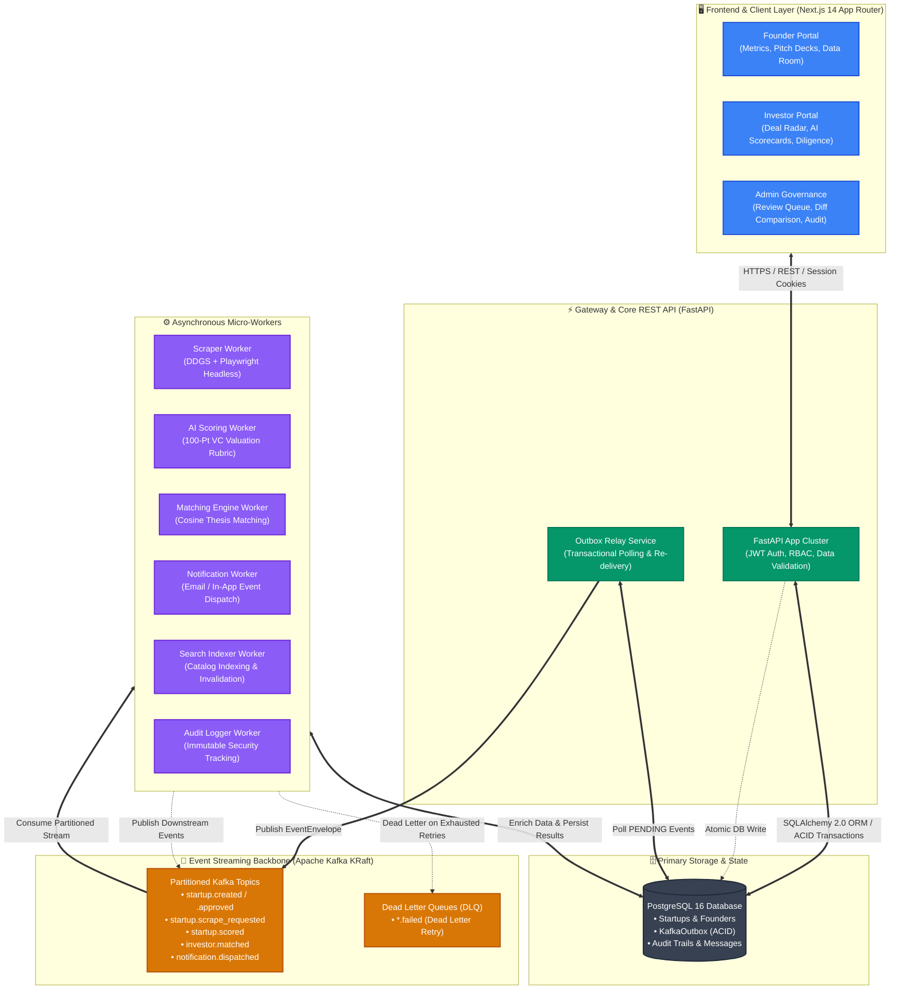
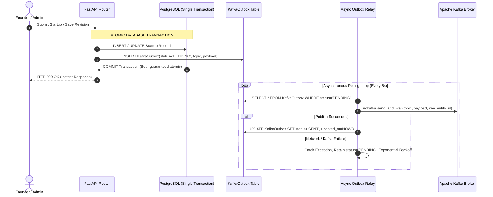
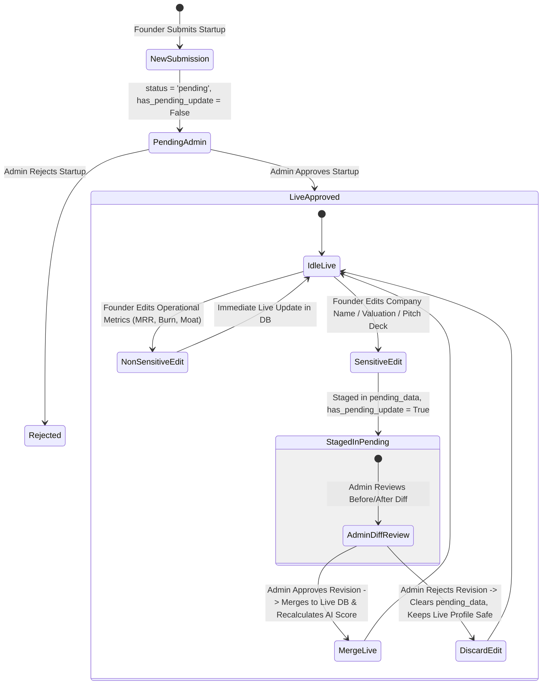

<div align="center">

# 🚀 FOUNDRY PLATFORM
### *Enterprise-Grade Event-Driven Startup Foundry & AI-Powered Venture Intelligence Ecosystem*

[](https://nextjs.org/)
[](https://fastapi.tiangolo.com/)
[](https://kafka.apache.org/)
[](https://www.postgresql.org/)
[](https://www.docker.com/)
[](https://www.python.org/)
[](https://deepmind.google/technologies/gemini/)
[](https://playwright.dev/)

<p align="center">
  <b>A distributed, high-throughput ecosystem bridging high-growth startups with accredited investors through automated Shark Tank deal valuation, autonomous dual-stage market reconnaissance, transactional outbox Kafka streaming, and zero-trust tiered verification governance.</b>
</p>

[System Architecture](#-system-architecture--distributed-design) • [Core Analytics & Metrics](#-key-analytics--system-highlights) • [Technical Modules](#-deep-dive-technical-modules) • [Event Streaming](#-event-driven-messaging--kafka-backbone) • [Quickstart](#-quickstart--deployment) • [API & Event Specs](#-api--event-specifications)

---

</div>

## 📊 Key Analytics & System Highlights

<div align="center">
<table>
  <tr>
    <td align="center" width="25%">
      <b>0.00%</b><br/>
      <sub><b>Dual-Write Event Loss</b></sub><br/>
      <small>Transactional Outbox Pattern guarantees atomic PostgreSQL commits & async Kafka relay</small>
    </td>
    <td align="center" width="25%">
      <b>100-Point</b><br/>
      <sub><b>Shark Tank AI Deal Scorer</b></sub><br/>
      <small>5-Pillar quantitative valuation & deal memo synthesis (Ollama / Gemini LLM)</small>
    </td>
    <td align="center" width="25%">
      <b>Dual-Stage</b><br/>
      <sub><b>Market Web Crawler</b></sub><br/>
      <small>DDGS market indexing + parallel headless Playwright browser DOM extraction</small>
    </td>
    <td align="center" width="25%">
      <b>Tiered</b><br/>
      <sub><b>Dual-Lane Governance</b></sub><br/>
      <small>Instant live operational metric updates vs zero-trust staged admin re-verification</small>
    </td>
  </tr>
  <tr>
    <td align="center" width="25%">
      <b>At-Least-Once</b><br/>
      <sub><b>Message Delivery Guarantee</b></sub><br/>
      <small>Partitioned topic keying, DLQ retry loops, and idempotent worker consumers</small>
    </td>
    <td align="center" width="25%">
      <b>Cosine Match</b><br/>
      <sub><b>Investor Recommendation</b></sub><br/>
      <small>Asynchronous vector similarity matching check size, domains & thesis alignment</small>
    </td>
    <td align="center" width="25%">
      <b>Bank-Grade</b><br/>
      <sub><b>Virtual Data Room (VDR)</b></sub><br/>
      <small>Granular NDA gatekeeping, dynamic watermarking, and immutable diligence audit logs</small>
    </td>
    <td align="center" width="25%">
      <b>Sub-Millisecond</b><br/>
      <sub><b>State Synchronization</b></sub><br/>
      <small>SSR Next.js 14 caching, optimistic UI updates, and WebSocket notification dispatch</small>
    </td>
  </tr>
</table>
</div>

---

## 🌟 System Architecture & Distributed Design

Foundry is architected as an **Event-Driven Distributed Microservice Platform**. The core REST API handles low-latency client transactions and offloads computationally heavy workloads (deep web scraping, LLM deal memo generation, investor matching, PDF pitch deck parsing, search indexing) onto independent, horizontally scalable background worker clusters via **Apache Kafka**.



---

## 🧠 Deep-Dive Technical Modules

### 1. 🛡️ Transactional Outbox Pattern (Solving the Distributed Dual-Write Problem)
In traditional microservice architectures, creating a database record and publishing an event to Kafka in the same request causes the **Dual-Write Problem**: if Kafka is temporarily unreachable, the database commit succeeds but the message is lost forever, leaving background jobs in limbo.



---

### 2. 🦈 Shark Tank AI Deal Evaluator & 100-Point VC Rubric
Foundry features a quantitative evaluation engine combining real-time competitive scraping with Large Language Models (**Ollama `qwen2.5:7b`** and **Google Gemini 1.5 Pro**) to synthesize automated investment deal memos.

```mermaid
flowchart LR
    subgraph Inputs["1. Raw Startup Data"]
        F1["Financials: MRR, Burn, Runway, Margin"]
        F2["Offer: Ask Amount, Equity %, Valuation"]
        F3["Founders: Roles, Experience, Team Size"]
        F4["Deck: Extracted Pitch Deck Text (PDF OCR)"]
    end

    subgraph Scraping["2. Dual-Stage Web Intelligence"]
        S1["DuckDuckGo Market Discovery"]
        S2["Playwright Deep Web Crawler"]
        S3["Extracted Competitors & Sector Sentiment"]
    end

    subgraph LLM["3. 5-Pillar Evaluation Engine"]
        E1["📈 Unit Economics & Traction (25 Pts)"]
        E2["👥 Team Execution DNA (20 Pts)"]
        E3["🎯 Market TAM & Defensibility (25 Pts)"]
        E4["💼 Valuation Realism & Terms (20 Pts)"]
        E5["✨ Pitch Clarity & Moat (10 Pts)"]
    end

    subgraph Output["4. Deal Intelligence Deliverables"]
        O1["🏆 Overall AI Score (0 - 100)"]
        O2["📋 Investment Verdict (Strong Buy, Consider, Pass)"]
        O3["💡 Strategic Strengths & Critical Red Flags"]
        O4["🛰️ Live Market Radar Widget"]
    end

    Inputs --> LLM
    Inputs --> Scraping --> LLM
    LLM --> Output
```



- **Resilient Multi-Tier Fallback**: If the remote LLM inference cluster is unreachable or experiences network latency, Foundry automatically switches to a deterministic mathematical heuristic engine, calculating weighted ratios for:
  $$\text{Valuation Multiple} = \frac{\text{Implied Valuation}}{\text{Annualized ARR}}$$
  $$\text{Capital Efficiency Score} = f(\text{MRR}, \text{Burn Rate}, \text{Runway})$$
  Ensuring **100% uptime** and zero UI blocking.

---

### 3. 🛡️ Tiered Verification & Zero-Downtime Governance
To balance founder agility with investor data protection, Foundry introduces a **Dual-Lane Field Governance Engine**:

| Field Classification | Fields Included | Behavior & Lifecycle | Security Level |
| :--- | :--- | :--- | :--- |
| **⚡ Instant Live Updates** | Tagline, Description, Stage, Domains, Website, Logo, MRR, Burn Rate, Runway, Gross Margin %, Competitors, Defensibility Moat | Updates applied live to production database immediately with zero founder friction. | Public Tier |
| **🛡️ Admin Re-verification Required** | Company Name, Pitch Deck (PDF), Ask Amount, Equity Offered %, Implied Valuation, Target Capital Needed, Total Raised, Team Members | Staged securely in `Startup.pending_data`. Live approved profile remains untouched for investors. Diff comparison rendered in Admin Queue. | Sensitive Governance Tier |



---

### 4. 💼 Virtual Data Room (VDR) & Diligence Access Control
- **Granular NDA Workflow**: Accredited investors must execute digital non-disclosure agreements before requesting data room access.
- **Document Watermarking**: Cap tables, financial models, tax returns, and legal contracts are dynamically watermarked with viewer email and access timestamp.
- **Audit Trails**: Every view, download, and permission request is logged into PostgreSQL with user metadata and IP addresses.

---

## 📨 Event-Driven Messaging & Kafka Backbone

### Standardized Event Envelope Schema
All distributed events conform to a versioned JSON schema envelope:

```json
{
  "event_id": "c7a2b918-4e12-4f9e-8c31-9b12d345e678",
  "event_type": "startup.approved",
  "timestamp": "2026-08-17T18:00:00Z",
  "version": "1.0",
  "source_service": "foundry-backend",
  "correlation_id": "a1b2c3d4-e5f6-7890-1234-56789abcdef0",
  "startup_id": "e9b8a7c6-d5e4-3f2a-1b0c-9d8e7f6a5b4c",
  "user_id": "f1e2d3c4-b5a6-7890-1234-56789abcdef0",
  "payload": {
    "startup_id": "e9b8a7c6-d5e4-3f2a-1b0c-9d8e7f6a5b4c",
    "approved_by": "f1e2d3c4-b5a6-7890-1234-56789abcdef0",
    "approval_notes": "Financial metrics and KYC verified",
    "approved_at": "2026-08-17T18:00:00Z"
  }
}
```

### Partitioning Strategy & Ordering Guarantees
- **Partition Key**: Events are keyed by `startup_id` or `user_id`, ensuring strict sequential message ordering across state transitions for a single entity.
- **Dead Letter Queue (DLQ)**: After 3 failed delivery attempts with exponential backoff, failing messages are dispatched to `.failed` DLQ topics for diagnostic inspection and replay.

---

## 💻 Tech Stack & Engineering Specifications

<div align="center">
<table>
  <thead>
    <tr>
      <th>Layer</th>
      <th>Technologies</th>
      <th>Key Architectural Responsibilities</th>
    </tr>
  </thead>
  <tbody>
    <tr>
      <td><b>Frontend</b></td>
      <td>
        
        
        
        
      </td>
      <td>Server-Side Rendering (SSR), optimistic UI state updates, glassmorphism design tokens, dynamic SVG radar charts, responsive mobile layouts.</td>
    </tr>
    <tr>
      <td><b>Backend API</b></td>
      <td>
        
        
        
        
      </td>
      <td>High-concurrency async REST gateway, strict Pydantic v2 data validation schemas, JWT & Firebase token authentication, RBAC middleware.</td>
    </tr>
    <tr>
      <td><b>Event Streaming</b></td>
      <td>
        
        
        
      </td>
      <td>Asynchronous event bus, Transactional Outbox Relay, consumer groups, partition key routing, Dead Letter Queues (DLQs).</td>
    </tr>
    <tr>
      <td><b>Data Persistence</b></td>
      <td>
        
        
        
      </td>
      <td>Relational normalization + JSONB document staging (`pending_data`, `ai_score_breakdown`), connection pooling, automated migrations.</td>
    </tr>
    <tr>
      <td><b>AI & Scraping</b></td>
      <td>
        
        
        
        
      </td>
      <td>Autonomous dual-stage headless scraping, LLM deal memo synthesis, pitch deck text parsing, multi-pillar rubric scoring.</td>
    </tr>
    <tr>
      <td><b>DevOps & Security</b></td>
      <td>
        
        
        
      </td>
      <td>Multi-container orchestration, zero-trust cryptographic role verification, isolated worker lifecycles, environment secret isolation.</td>
    </tr>
  </tbody>
</table>
</div>

---

## 📁 Repository & Directory Layout

```
startup_Foundary/
├── backend/
│   ├── alembic/                 # Automated database schema migrations
│   ├── core/                    # Security tokens, JWT hashing & environment config
│   ├── database.py              # SQLAlchemy engine & session maker
│   ├── docker-compose.yml       # PostgreSQL & Kafka KRaft multi-container stack
│   ├── kafka/                   # Centralized Kafka infrastructure module
│   │   ├── admin.py             # Topic auto-provisioning & DLQ configuration
│   │   ├── consumer.py          # Resilient async consumer wrapper with retry loops
│   │   ├── manager.py           # Producer & consumer lifecycle controller
│   │   ├── producer.py          # Asynchronous partition-keyed event publisher
│   │   ├── schemas.py           # Versioned EventEnvelope JSON contracts
│   │   └── topics.py            # Global topic constants & DLQ mappings
│   ├── main.py                  # FastAPI application entrypoint & lifespan hooks
│   ├── models.py                # Normalized ORM entities (User, Startup, Outbox, DataRoom)
│   ├── routers/                 # Modular API endpoints
│   │   ├── admin.py             # Queue management, before/after diffs, approval engine
│   │   ├── auth.py              # Firebase & custom admin JWT login pipelines
│   │   ├── dataroom.py          # Secure VDR document storage & watermarking
│   │   ├── feed.py              # Founder ecosystem discussions & threaded replies
│   │   ├── messages.py          # Real-time founder-investor direct messaging
│   │   ├── startup.py           # Startup CRUD, pitch uploads & tiered edit governance
│   │   └── users.py             # User profile resolution & KYC status
│   ├── schemas.py               # Pydantic v2 validation models & request contracts
│   ├── services/                # Heavy business logic & intelligence
│   │   ├── ai_scorer.py         # 100-Point VC rubric & quantitative evaluation logic
│   │   ├── market_radar.py      # Real-time sector intelligence & competitor analysis
│   │   ├── outbox_relay.py      # Transactional Outbox async relay polling loop
│   │   ├── pitch_deck_parser.py # PDF slide text extraction & financial analysis
│   │   └── scraper.py           # DDGS + Playwright dual-stage crawler
│   └── workers/                 # Event-driven consumer processes
│       ├── ai_scoring_worker.py # Kafka consumer for AI deal evaluation
│       ├── audit_worker.py      # Kafka consumer for immutable security logs
│       ├── matching_worker.py   # Vector thesis & investor matching consumer
│       ├── notification_worker.py # Email & push notification dispatcher
│       ├── outbox_worker.py     # Standalone outbox relay background daemon
│       ├── scraper_worker.py    # Headless Playwright crawling consumer
│       └── search_indexer_worker.py # Catalog indexation & cache invalidator
│
├── frontend/
│   ├── app/                     # Next.js 14 App Router
│   │   ├── (auth)/              # Authentication pages (Login, Register, Role Onboarding)
│   │   ├── admin/               # Admin Portal (Audit logs, Revisions Queue, Approvals)
│   │   ├── feed/                # Founder & Investor Community Discussion Feed
│   │   ├── founder/             # Founder Portal (Dashboard, Startup Management, Data Room)
│   │   ├── investor/            # Investor Portal (Deal Radar, AI Scorecards, Diligence VDR)
│   │   └── layout.js            # Root layout with Toast, Redux & Auth Providers
│   ├── components/              # 20+ Production React components
│   │   ├── AdminQueue.jsx       # Tabbed review queue with Before/After Diff Inspector
│   │   ├── DataRoomSection.jsx  # VDR document manager with NDA gating
│   │   ├── MarketRadarWidget.jsx # Real-time market competitor display
│   │   ├── MessageThread.jsx    # Real-time direct messaging chat UI
│   │   └── ...                  # Sidebars, modals, pagination, user profile widgets
│   ├── features/                # Redux Toolkit slices (authSlice, startupSlice)
│   └── middleware.js            # Next.js route protection & SSR role gatekeeper
│
├── Architecture.md              # In-depth architectural sequence & flow diagrams
├── API.md                       # Full REST API endpoint reference & schemas
├── Kafka.md                     # Apache Kafka configuration, topics & DLQ specifications
└── Worker.md                    # Worker orchestration & event consumer lifecycle guide
```

---

## ⚡ Quickstart & Deployment Guide

### 1. Prerequisites
- **Python**: `3.10` or higher
- **Node.js**: `18.0` or higher (`npm 9+`)
- **Docker & Docker Compose**: For PostgreSQL & Apache Kafka
- **Ollama** *(Optional for local AI inference)*: `ollama pull qwen2.5:7b`

---

### 2. Infrastructure Setup (Docker Compose)
Start the PostgreSQL database and Apache Kafka broker in KRaft mode:

```bash
cd backend
docker-compose up -d postgres kafka
```

---

### 3. Backend Setup
```bash
cd backend

# Create and activate virtual environment
python -m venv venv

# Windows:
.\venv\Scripts\activate
# macOS/Linux:
source venv/bin/activate

# Install dependencies & Playwright browser binaries
pip install -r requirements.txt
playwright install chromium

# Run database migrations
alembic upgrade head

# Start FastAPI development server
uvicorn main:app --reload --port 8000
```
> FastAPI Swagger documentation available at: `http://127.0.0.1:8000/docs`

---

### 4. Running Distributed Kafka Workers
Run the background micro-workers in dedicated terminal windows or supervisor processes:

```bash
cd backend

# 1. Scraper Worker (Web reconnaissance)
python workers/scraper_worker.py

# 2. AI Scoring Worker (Shark Tank Deal Evaluator)
python workers/ai_scoring_worker.py

# 3. Investor Matching Engine
python workers/matching_worker.py

# 4. Notification & Audit Workers
python workers/notification_worker.py
python workers/audit_worker.py
```

---

### 5. Frontend Setup
```bash
cd frontend

# Install Node dependencies
npm install

# Start Next.js development server
npm run dev
```
> Foundry Web Application active at: `http://localhost:3000`

---

## 🧪 Automated Testing & Verification

Foundry includes end-to-end automated integration tests verifying database transactions, outbox atomic publishing, tiered edit staging, before/after diff computation, and AI scoring fallback workflows.

Run the verification test suite:

```bash
cd backend
python scratch/test_tiered_verification.py
```

**Test Output:**
```text
[OK] Created test founder and admin
[OK] Created pending startup: Alpha Origin Inc (status=pending)
[OK] Startup correctly appeared in Admin Queue 'New Applications'
[OK] Startup approved! Status=approved, AI Score=85
[OK] Non-sensitive fields updated live immediately without admin intervention!
[OK] Sensitive fields safely staged into pending_data with has_pending_update=True!
[OK] Admin Queue contains revision diff: [('Company Name', 'Alpha Origin Inc', 'Alpha NextGen Corp'), ('Ask Amount ($)', 100000.0, 500000.0), ('Equity Offered (%)', 10.0, 15.0)]
[OK] Admin successfully approved revision and merged changes live!
[OK] Admin revision rejection successfully discarded pending edit without killing live startup!

ALL TIERED VERIFICATION TESTS PASSED SUCCESSFULLY!
```

---

## 🔒 Security & Enterprise Compliance

- **Zero-Trust Role-Based Access Control (RBAC)**: Enforced across both Next.js edge middleware and FastAPI dependency injectors (`get_current_user`, `require_admin`, `require_approved_investor`).
- **Data Room Access Control**: Granular NDA digital signatures, time-limited access tokens, and dynamic viewer watermarking on confidential financial models and cap tables.
- **Audit & Compliance**: All critical actions (approvals, rejections, deal terms revisions, NDA signings, document views) emit structured audit records persisted in the `AuditLog` table.
- **Dual Auth Resilience**: Automatic session synchronization across Firebase Authentication and custom signed JWT HTTP-only cookies with automatic refresh.

---

## 📄 License & Attribution

This project is licensed under the **MIT License** — feel free to explore, fork, and build upon it.

<div align="center">
  <sub>Built with ❤️ by the Foundry Engineering Team. Designed for scalable, event-driven venture intelligence.</sub>
</div>
