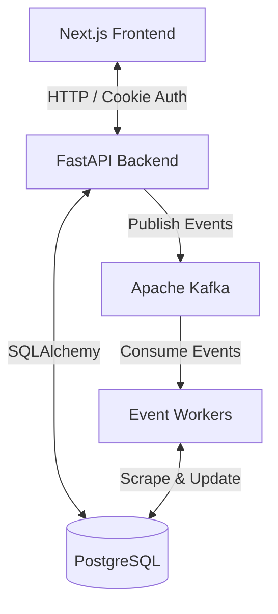

# Foundry Platform 🚀

Foundry is a multi-role startup-investor matching platform and founder community hub built with an event-driven microservices architecture using Next.js (Frontend), FastAPI (Backend REST API), PostgreSQL (Database), and Apache Kafka (Event Backbone).

---

## 🌟 Architecture Summary

Foundry uses Apache Kafka as an asynchronous event-driven backbone to decouple core API services from background workers (web scraping, AI deal evaluation, deal matching, audit logging, search indexing, and transactional notification dispatch).



---

## 📁 Repository Structure

```
startup_Foundary/
├── backend/
│   ├── core/               # Configuration & Security (JWT, settings)
│   ├── database.py         # SQLAlchemy connection pooling
│   ├── docker-compose.yml  # PostgreSQL & Kafka KRaft container stack
│   ├── kafka/              # Centralized Kafka infrastructure module
│   │   ├── config.py       # Kafka settings
│   │   ├── consumer.py     # Async consumer wrapper & DLQ handling
│   │   ├── manager.py      # KafkaManager lifecycle controller
│   │   ├── producer.py     # Async producer wrapper & partition keying
│   │   ├── schemas.py      # Versioned event payload envelopes
│   │   └── topics.py       # Topic constants & DLQ mapping
│   ├── main.py             # FastAPI entrypoint with lifespan event context
│   ├── models.py           # Database models (User, Startup, AdminAction)
│   ├── routers/            # FastAPI API Routers (auth, startup, admin, etc.)
│   ├── services/           # Business logic (scraper, ai_scorer, market radar)
│   └── workers/            # Event-driven background workers
│       ├── scraper_worker.py        # Top-10 Dual-stage scraper (ddgs + Playwright)
│       ├── ai_scoring_worker.py     # 100-Point VC Rubric Evaluator (qwen2.5:7b)
│       ├── audit_worker.py
│       ├── matching_worker.py
│       ├── notification_worker.py
│       └── search_indexer_worker.py
├── frontend/               # Next.js 16 App Router UI
├── Architecture.md         # Detailed System Architecture & Diagrams
├── Backend.md              # Backend Architecture & Models Guide
├── Deployment.md           # Deployment & Docker Instructions
├── API.md                  # API Endpoint & Event Specification
├── Worker.md               # Worker Pipeline & Consumer Guide
└── Kafka.md                # Apache Kafka Architecture & Messaging Specs
```

---

## ⚡ Quickstart & Local Setup

### 1. Requirements
- Python 3.10+
- Node.js 18+
- Docker & Docker Compose
- Ollama (`ollama pull qwen2.5:7b`)

### 2. Running Kafka & PostgreSQL via Docker
```bash
cd backend
docker-compose up -d postgres kafka
```

### 3. Running Backend Services
```bash
cd backend
python -m venv venv
# On Windows:
.\venv\Scripts\activate
# On Linux/macOS:
source venv/bin/activate

pip install -r requirements.txt
playwright install chromium
uvicorn main:app --reload --port 8000
```

### 4. Running Event Workers (Standalone or Background)
```bash
python workers/scraper_worker.py
python workers/ai_scoring_worker.py
python workers/notification_worker.py
python workers/matching_worker.py
python workers/search_indexer_worker.py
python workers/audit_worker.py
```

### 5. Running Frontend
```bash
cd frontend
npm install
npm run dev
```

---

## 📚 Documentation Index

- [Kafka Architecture Guide](Kafka.md)
- [System Architecture](Architecture.md)
- [Backend Documentation](Backend.md)
- [Deployment Guide](Deployment.md)
- [API & Event Specification](API.md)
- [Workers Guide](Worker.md)
